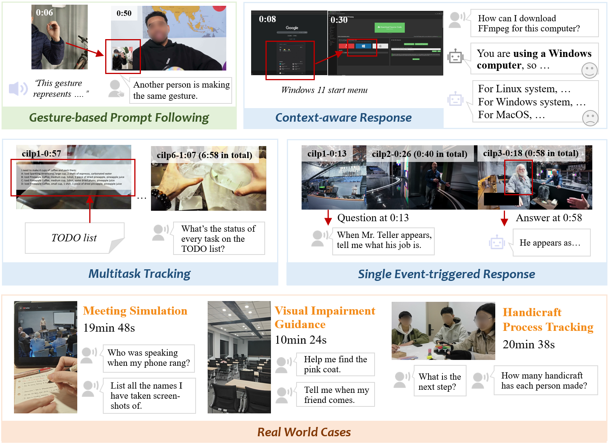
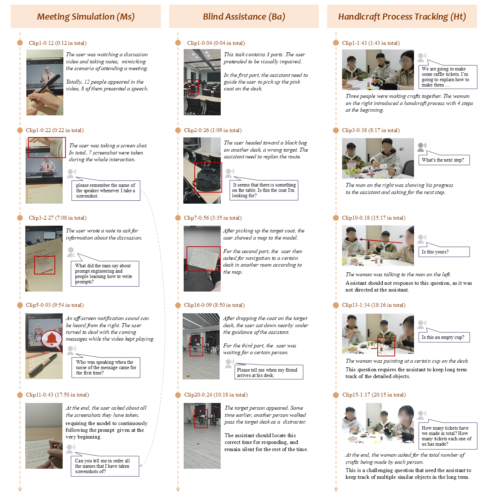
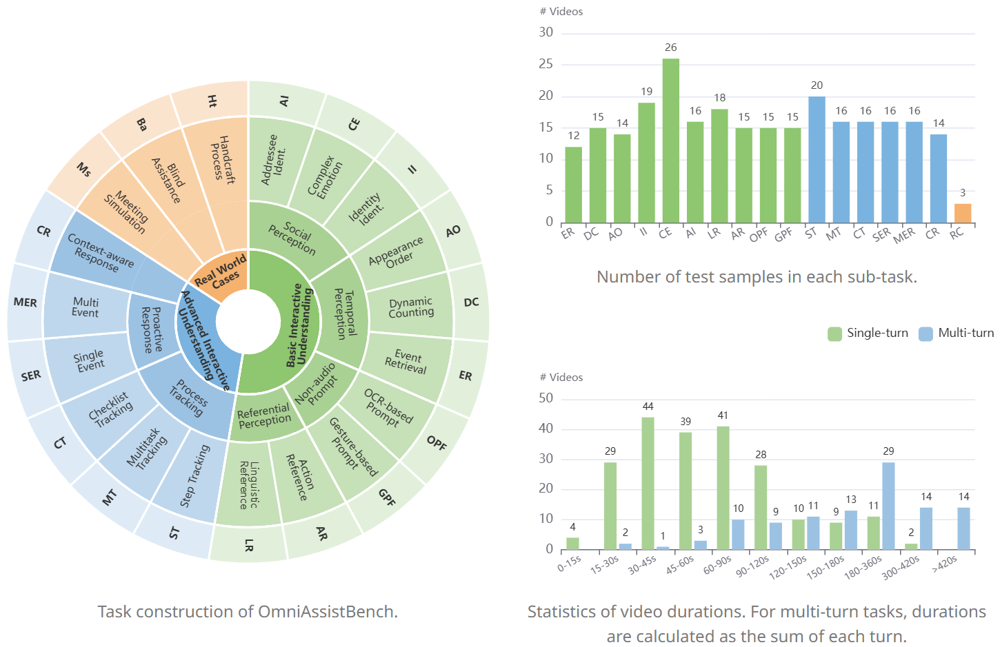
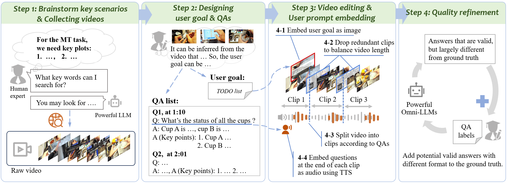

# OmniAssistBench
<div align="center">

# 🤖🤝OmniAssistBench: Assistant-style Interaction Benchmark for Omni-LLMs

<!-- Badges -->

[](#)
[](#)
[](#)

The dataset and the paper will be made public after review.

</div>

---

## 💡 Introduction

**OmniAssistBench** is the first benchmerk specially designed to evaluate Omni-modal large language models (Omni-LLMs) under assistant-style, real-time video chat scenarios.

<div align="center">
  
  <p>
<i>Examples of four typical tasks in OmniAssistBench.
</i></p>
</div>

<details>   
<summary>
Click here for the key plots of the real world cases</summary>      
<div align="center">     
<br>     
     
<p>
<i>Examples of key plots and questions from the three Real World Cases.</i>
</p>   
</div>  
</details>

#### 🧠 Two-Tier Evaluation Framework

* 🟢 **Basic Tier:** Core perception and multimodal instruction following (e.g., social understanding, temporal perception, and gesture-based prompts).
* 🔵 **Advanced Tier:** Higher-level interactive skills (e.g., procedural guidance and proactive response).

<div align="center">
  
  <p>
<i>Task construction and statistics of OmniAssistBench.
</i></p>
</div>

<div align="center">
  
  <p>
<i>The data construction process of OmniAssistBench.
</i></p>
</div>

#### 📊 Dataset Highlights

* 📈 **Scale**: **687** open-ended question-answer pairs from **300** videos, covering 7 major task types and **17** fine-grained tasks.
* **🎥 Custom-Filmed Real-World Cases**: Features three comprehensive multi-turn interaction case studies exclusively filmed by our team to reflect genuine assistant usage.
* **🔊 Naturally Embedded Prompts**: Unlike traditional benchmarks with text-only prompts, **all user questions are embedded directly into the videos** as realistic audio or typing/handwriting.
* **⏳ High Quality & Effort**: Creating the dataset required careful choices of source videos and heavy video editing to balance video length and to embed the user prompts. Every sample was rigorously annotated by human experts, demanding **~4 hours of labor per sample**.

---

## 🏆 Leaderboard

OmniAssistBench requires candidate models to be capable of processing videos along with the corresponding audios. All models are graded using our LLM-as-a-Judge pipeline on a 0 - 5 scale.

| Model | Size | Basic Tier | Advanced Tier | Real Cases | Overall (/5.0) | Percentage (%) |
|:---|:---:|:---:|:---:|:---:|:---:|:---:|
| **Gemini-3-Pro** | - | 3.18 | 3.41 | 3.40 | **3.32** | 66.4%|
| **MiniCPM-o 4.5** | 9B | 2.23 | 2.39 | 1.89 | **2.30** | 46.0% |
| **Qwen3-Omni** | 30B-A3B | 1.42 | 1.82 | 1.76 | **1.68** | 33.6% |
| **Baichuan-Omni 1.5** | 7B | 1.23 | 2.09 | 1.76 | **2.16** | 43.2% |

OmniAssistBench is highly challenging. Current evaluations show that even the most advanced models have substantial room for improvement before they can serve as reliable real-world assistants.

---

## 📍Evaluation Pipeline

Our evaluation process is standardized into three steps:

**1. Get Model Response:** Because inference processes vary across different model, the exact evaluation code depends on the model. The result should be saved as a CSV file including two columns: `video_name` and `output_text`.

Key point is to include the following system prompt:

```text[System]
You are a helpful video assistant. For the above input video(s), if you decide to output, organize your output as if you are directly talking
to the user. Otherwise, if you decide to keep quiet, output exactly "[KEEP QUIET]".
```

We provide two example scripts of evaluating Gemini3 Pro via API and evaluating Qwen3-Omni via local inference. Please refer to the comments for handling multi-turn test samples:

* [`/eval_oe_qwen3omni.py`](./eval_qwen3omni.py)
* [`/eval_oe_gemini3.py`](./eval_gemini3.py) 

**2. LLM-as-a-Judge Scoring:** We utilize an advanced LLM as a judge to grade the model's `output_text` from 0 to 5. The output of this step is a CSV file containing the `video_name`, `video_class`, and `score`.

Here is a brief summary of what each score represents. Please refer to [`score_rubric.txt`](./score_rubric.txt) for the detailed scoring criteria.

| Score | Criteria Summary |
|:---:|:---|
| **5** | **Excellent**: Semantically correct and comprehensive. |
| **4** | **Good**: Mostly correct and comprehensive, but with minor errors.|
| **3** | **Partial**: Mostly correct but missing key points.|
| **2** | **Hallucinated**: Comprehends the user's intent, but gives incorrect answer. |
| **1** | **Related**: Fails to comprehend the user's intent, and gives responses loosely related to the video. |
| **0** | **Failure**: Fails to comprehend the user's intent, and gives unrelated responses. |

An example judgment script using GPT-5 is provided in[`/judge_gpt5.py`](./judge_gpt5.py).

**3. Calculate Task Averages:** Once the grading is complete, you can aggregate the results to see how the model performs across different tasks. We provide a script ([`/calculate_average_score.py`](./calculate_average_score.py)) that reads the judgment CSV and automatically calculates the average scores at sub-task level, major-task level and tier-level.


